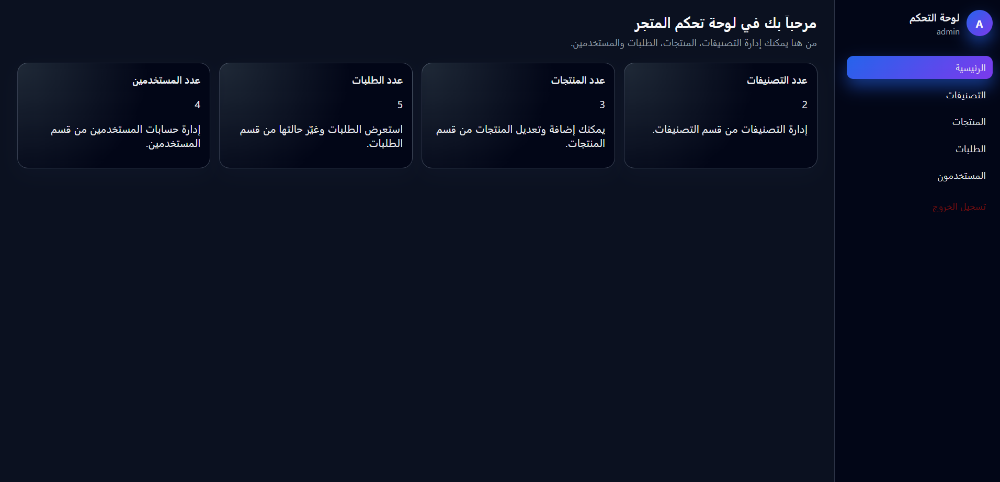
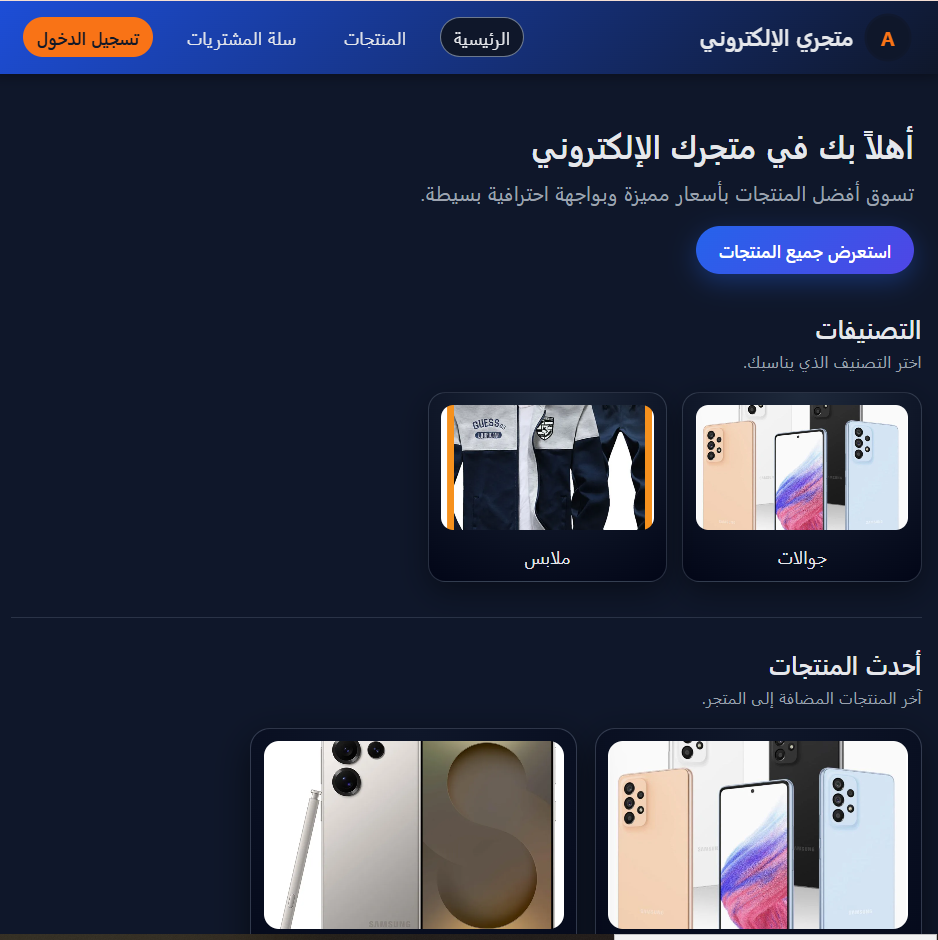
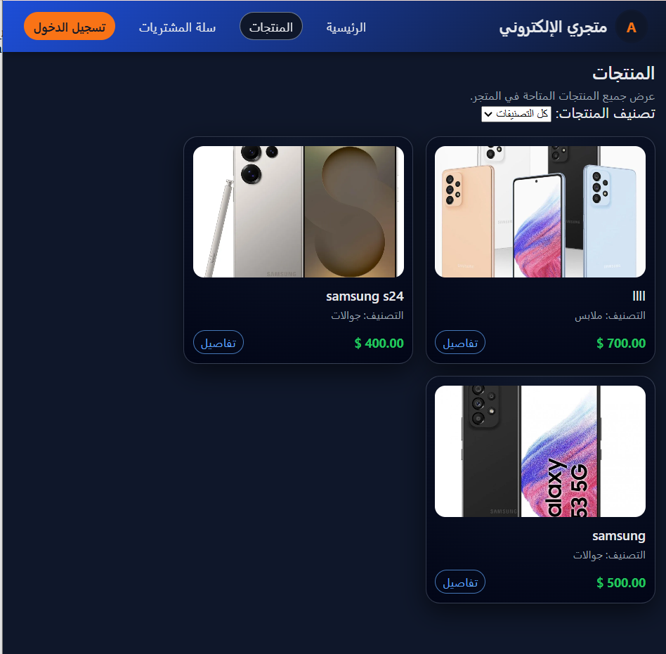
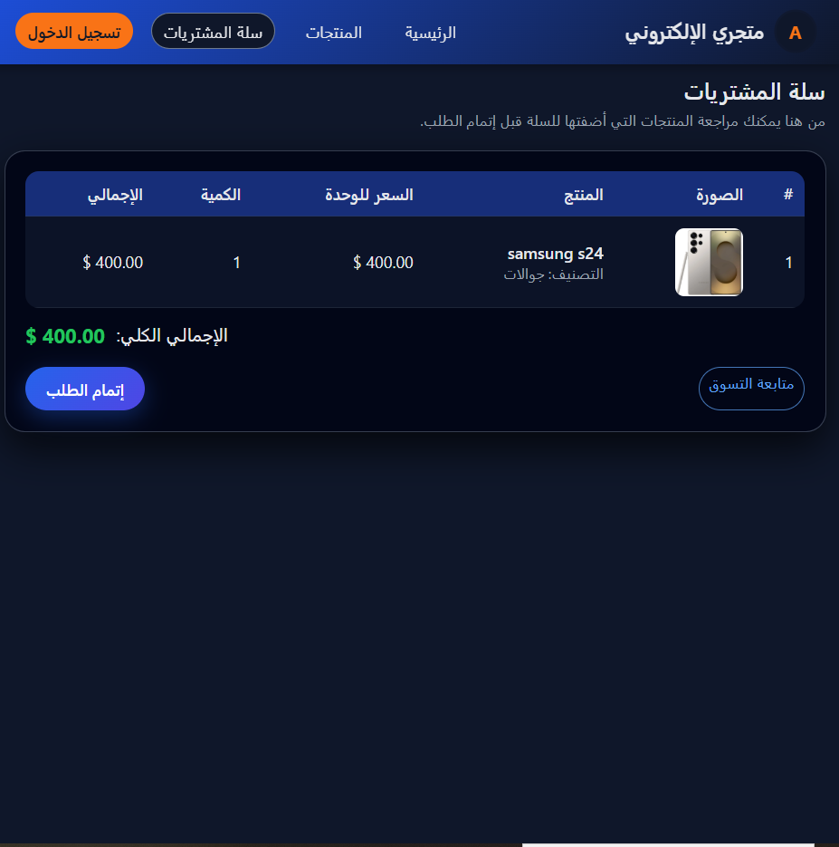
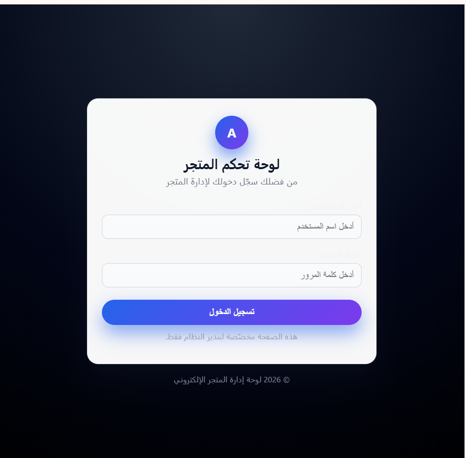
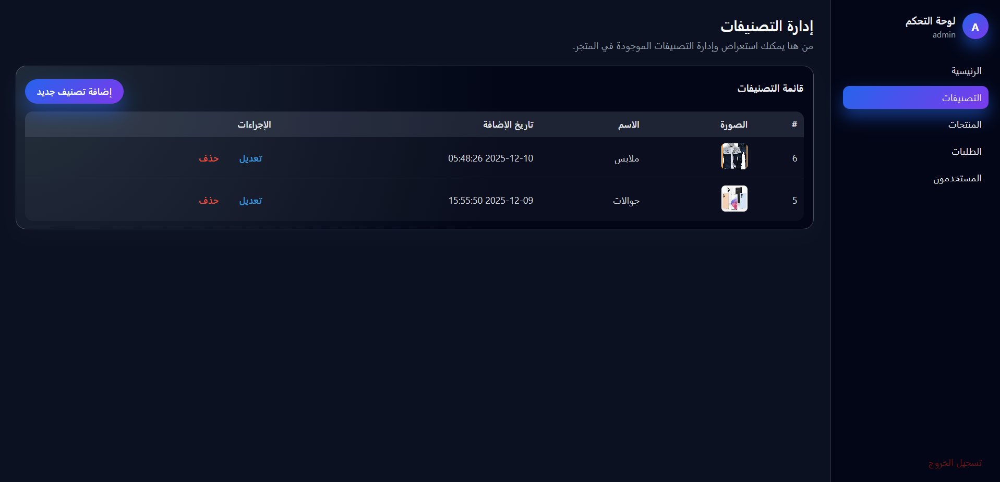
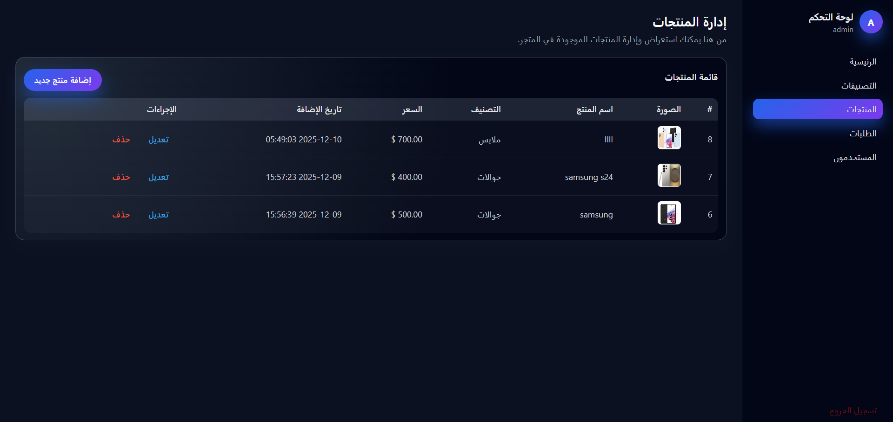
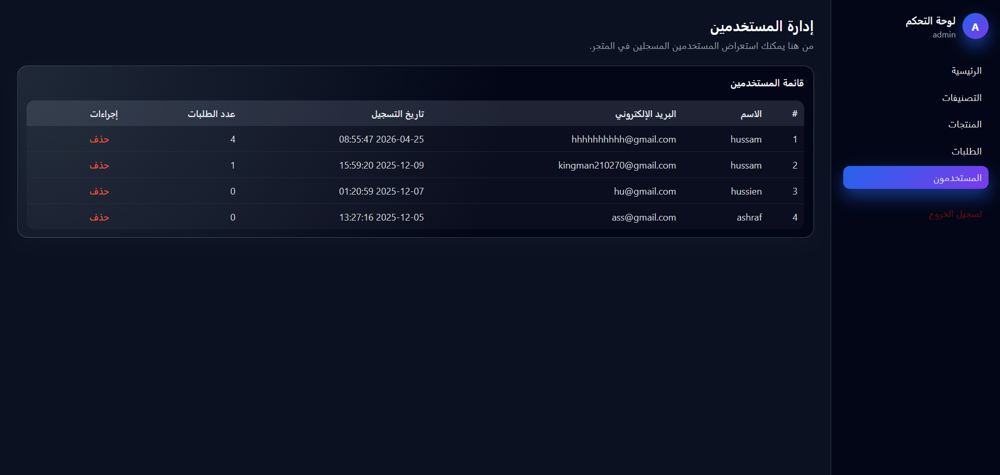
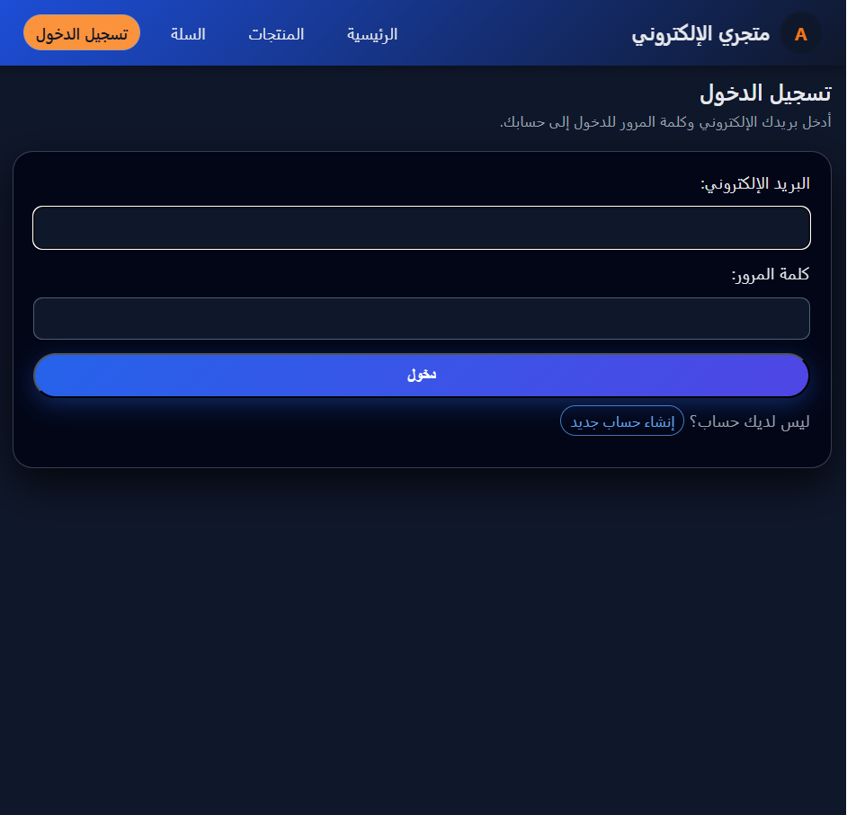
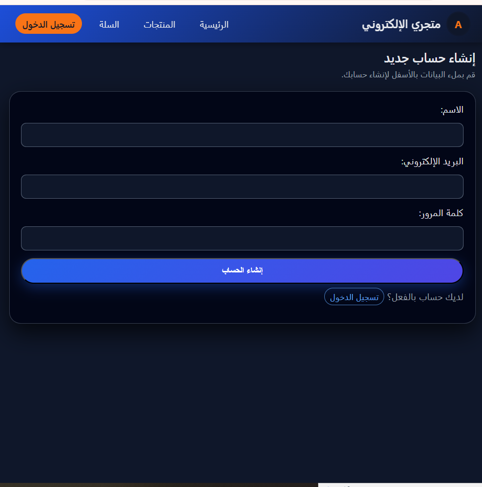

#  E-Commerce Website Project

#  Overview
This is a full-stack **E-Commerce Web Application** developed using **PHP, MySQL, HTML, CSS, and **.

The system provides both:
-  User interface for shopping experience
-  Admin dashboard for full system management

---

# Key Features

# User Side
- User registration and login system
- Browse products by categories
- View product details
- Shopping cart system
- Checkout and order placement

# Admin Panel
- Secure admin authentication
- Dashboard overview
- Manage products (Add / Edit / Delete)
- Manage categories
- Manage users
- Manage orders & update status

---

# Technologies Used
- PHP (Backend)
- MySQL (Database)
- HTML5
- CSS3
- Git & GitHub


---

# Screenshots

# Main Pages
  
  
  

---

# Cart & Orders
  
  
  

---

# Admin Panel
  
  
  
  
  
  

---

# Authentication
  
  

---

# Installation & Setup

1. Clone the repository:
```bash
git clone https://github.com/username/repository-name.git

---

## 📁 Project Structure
